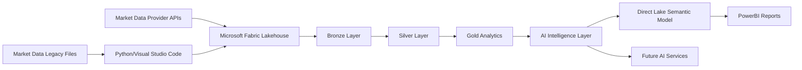

# atlas
Enterprise AI Intelligence Platform powered by Microsoft Fabric, Azure AI and Power BI

**Current Release:** v0.8.0 – AI Trading Intelligence Foundation

## High-Level Data Architecture



## Development Architecture

```mermaid
flowchart LR

A["VS Code<br/>Python Development"]

B["Microsoft Fabric<br/>Workspace"]

C["GitHub<br/>dev"]

D["Pull Request"]

E["GitHub<br/>main"]

F["Version Tag"]

A --> C
B --> C
C --> D
D --> E
E --> F