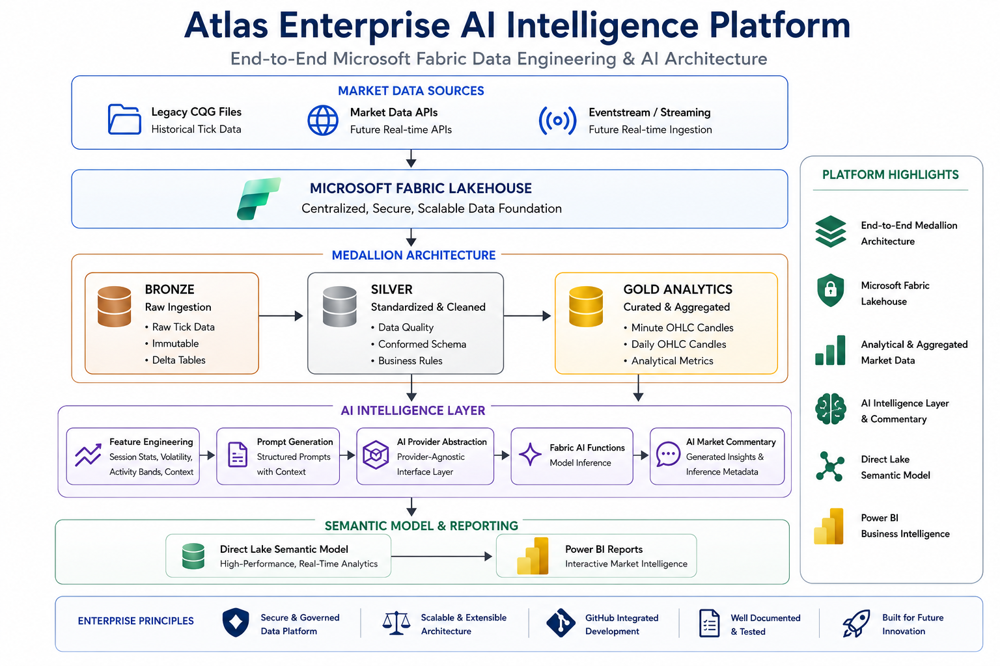
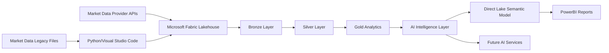
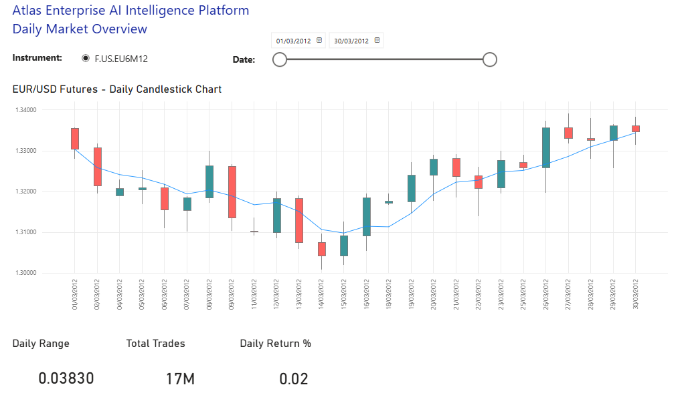
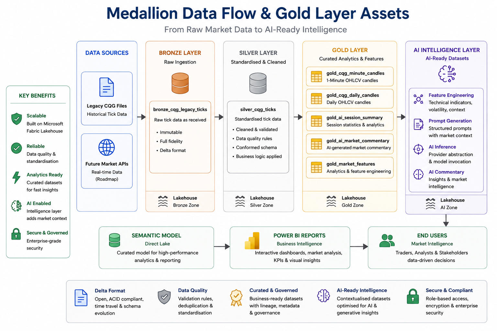
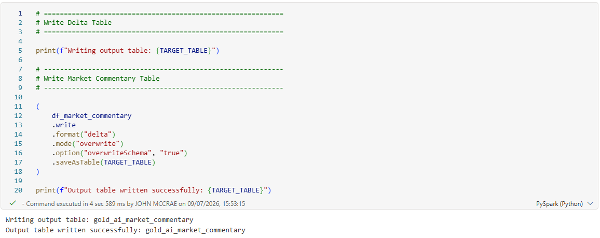
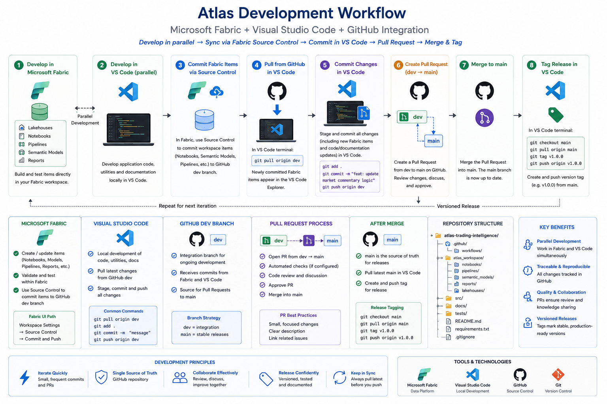

# Atlas Enterprise AI Intelligence Platform
Enterprise Microsoft Fabric • Data Engineering • Artificial Intelligence • Power BI • Python

### End-to-End Microsoft Fabric Data Engineering & AI Portfolio Project

> A professional portfolio project demonstrating modern Microsoft Fabric data engineering, AI integration, and Power BI analytics using an enterprise Medallion architecture.


---

# Executive Summary

Atlas is an enterprise-style Data & AI engineering portfolio project demonstrating the complete lifecycle of market data ingestion, transformation, analytics, AI enrichment and business intelligence using the Microsoft Fabric platform.

The project follows a modern Medallion Architecture, progressing from raw market data through Bronze, Silver and Gold layers before producing AI-ready analytical datasets and interactive Power BI dashboards.

Rather than focusing on trading strategy implementation, Atlas demonstrates enterprise engineering principles including data platform architecture, AI integration, semantic modelling, source control, documentation and professional development workflows.

---

# Platform Architecture

Atlas follows a modern enterprise Medallion Architecture implemented in Microsoft Fabric. The platform ingests historical market data, transforms it through Bronze, Silver and Gold layers, enriches the analytical datasets using an AI abstraction layer, and exposes curated business intelligence through a Direct Lake Semantic Model and Power BI.



---

# Key Capabilities

- Enterprise Medallion Architecture (Bronze / Silver / Gold)
- Microsoft Fabric Lakehouse
- Delta Table processing
- Minute and Daily OHLC candle generation
- AI-ready feature engineering
- Provider-agnostic AI abstraction layer
- AI-generated market commentary
- Direct Lake Semantic Model
- Interactive Power BI trading dashboards
- GitHub integrated Microsoft Fabric development workflow
- Professional engineering documentation

---

## End-to-End Data Flow



---

# Technology Stack

| Area | Technology |
|------|------------|
| Data Platform | Microsoft Fabric |
| Storage | Lakehouse / Delta Tables |
| Processing | PySpark |
| Programming | Python |
| Analytics | Gold Layer |
| Semantic Model | Direct Lake |
| Reporting | Power BI |
| AI | Microsoft Fabric AI Functions |
| Source Control | GitHub |
| Development | Visual Studio Code |

---

# AI Architecture

Atlas deliberately separates deterministic analytics from non-deterministic AI inference.

### Deterministic

- Bronze ingestion
- Silver transformation
- Gold analytics
- Session statistics
- Volatility metrics
- Prompt generation

### Non-Deterministic

- AI Provider abstraction
- Model invocation
- AI commentary generation
- Inference metadata
- Error handling
- Provider independence

This architectural separation enables different AI providers to be integrated without affecting the analytical processing pipeline.

---

# Repository Structure

```text
Atlas/

├── fabric/              Microsoft Fabric artefacts
├── src/                 Python source code
├── scripts/             Development utilities
├── docs/                Project documentation
├── images/              Screenshots & diagrams
├── tests/               Unit tests

├── README.md
├── INSTALLATION.md
├── requirements.txt
├── CHANGELOG.md
├── RELEASE_HISTORY.md
└── LICENSE
```

---

# Project Screenshots

## Interactive Trading Dashboard

Atlas exposes curated Gold Layer analytics through a Direct Lake Semantic Model and an interactive Power BI report.

The dashboard demonstrates minute and daily market analytics, candlestick visualisation, session statistics and AI-ready analytical features.



---

### Medallion Data Flow & Gold Layer Assets

Atlas implements a modern Medallion Architecture within Microsoft Fabric. Raw market data is ingested into the Bronze layer, standardised in Silver, and curated into analytical assets in the Gold layer. These datasets then feed the AI Intelligence layer before being exposed through a Direct Lake Semantic Model and Power BI reporting.



---

## AI Market Commentary Notebook

The AI Intelligence layer demonstrates structured prompt generation, provider abstraction, inference metadata capture and graceful failure handling. Inference errors are recorded without interrupting the deterministic analytics pipeline.



---

## GitHub Development Workflow

Atlas follows a professional Git-based development workflow. Microsoft Fabric Source Control is integrated with GitHub, enabling feature development in the `dev` branch, pull requests into `main`, versioned releases and reproducible project history.

The repository demonstrates modern engineering practices including source control, release tagging, documentation and incremental delivery through milestone-based development.



---

# Documentation

| Document | Description |
|----------|-------------|
| INSTALLATION.md | Installation and environment setup |
| CHANGELOG.md | Technical change history |
| RELEASE_HISTORY.md | Project evolution and milestones |
| docs/Development_Workflow.md | GitHub / Fabric workflow |
| docs/Architecture.md | Platform architecture |
| docs/AI_Architecture.md | AI architecture |

---

# Current Project Status

| Component | Status |
|-----------|--------|
| Bronze Layer | ✅ Complete |
| Silver Layer | ✅ Complete |
| Gold Analytics | ✅ Complete |
| Power BI Dashboard | ✅ Complete |
| AI Abstraction Layer | ✅ Complete |
| Fabric AI Integration | ✅ Complete |
| Portfolio Documentation | ✅ Complete |
| v1.0.0 MVP | ✅ Complete |

---

# Known Limitations

Microsoft Fabric Trial capacities currently do not support AI Functions.

During inference the platform correctly captures:

- Provider
- Model
- Error status
- Generated timestamp
- Failure metadata

This is a Microsoft Fabric environment limitation rather than a software defect.

All deterministic processing remains fully operational.

---

# Roadmap

Future development may include:

- Real-Time Intelligence
- Eventstream ingestion
- Eventhouse integration
- Streaming analytics
- Additional AI providers
- Azure AI Foundry integration
- Automated testing
- CI/CD deployment
- Strategy back-testing
- Trading signal generation

---

# Portfolio Relevance

Atlas Enterprise AI Intelligence Platform has been developed as a professional Microsoft Fabric portfolio project demonstrating:

- Enterprise Data Engineering
- Microsoft Fabric
- Lakehouse Architecture
- Medallion Design Pattern
- Power BI
- AI Integration
- GitHub Source Control
- Python Engineering
- Technical Documentation
- Solution Architecture

The project is intended to showcase engineering capability, software architecture and best practices rather than provide a production trading platform.

---

# Disclaimer

Atlas Enterprise AI Intelligence Platform is provided for demonstration and educational purposes.

It is **not** a production trading system and does **not** provide financial or investment advice.

Any AI-generated market commentary is illustrative only and should not be relied upon when making trading or investment decisions.

---

## Current Release

**v1.0.0 MVP — Atlas Enterprise AI Intelligence Platform**