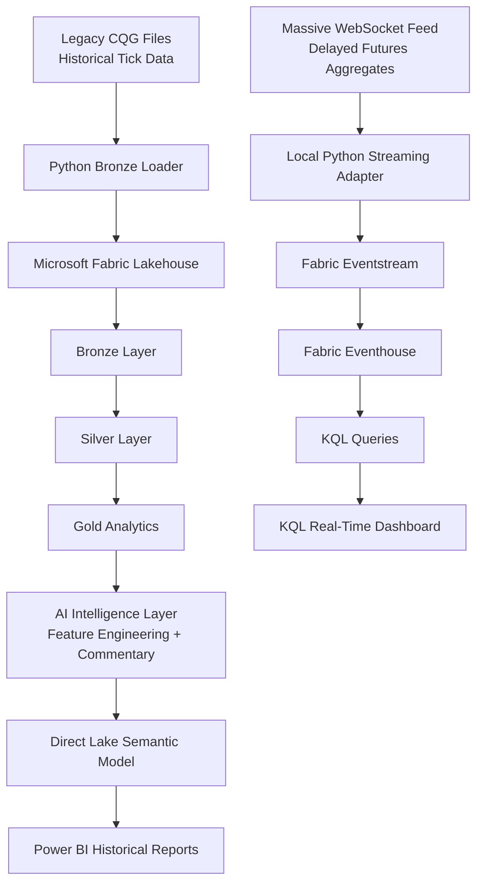
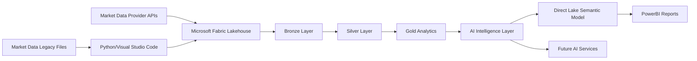
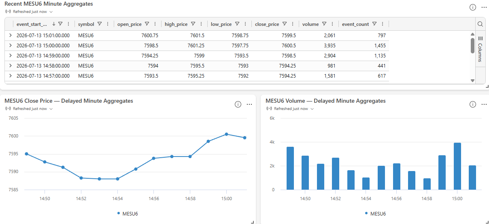

# Atlas Enterprise AI Intelligence Platform
Enterprise Microsoft Fabric • Data Engineering • Artificial Intelligence • Power BI • Python

### End-to-End Microsoft Fabric Data Engineering & AI Portfolio Project

> A professional portfolio project demonstrating modern Microsoft Fabric data engineering, AI integration, and Power BI analytics using an enterprise Medallion architecture.


---

# Executive Summary

Atlas is an enterprise-style Data & AI engineering portfolio project demonstrating the complete lifecycle of market data ingestion, transformation, analytics, AI enrichment and business intelligence using Microsoft Fabric.

The platform now supports two complementary data patterns:

- **Historical batch analytics** using legacy CQG market data files loaded into the Microsoft Fabric Lakehouse and processed through a Medallion Architecture.
- **Near-real-time market data ingestion** using a local Python streaming adapter, Microsoft Fabric Eventstream, Eventhouse and KQL dashboards.

Atlas is intentionally focused on **enterprise engineering capability** rather than trading strategy implementation. It demonstrates modern architecture, source control, documentation, semantic modelling, AI integration, real-time ingestion design, and professional delivery workflows in a single cohesive portfolio project.

---

# Platform Architecture

Atlas follows a modern enterprise Medallion Architecture implemented in Microsoft Fabric. The platform ingests historical market data, transforms it through Bronze, Silver and Gold layers, enriches the analytical datasets using an AI abstraction layer, and exposes curated business intelligence through a Direct Lake Semantic Model and Power BI.


---

# Near-Real-Time Market Data Foundation (v1.1.0)

Atlas v1.1.0 extends the original MVP by introducing a near-real-time ingestion path for delayed futures market data.

This new capability demonstrates how Fabric Real-Time Intelligence can complement the Lakehouse-based historical analytics platform. A local Python adapter retrieves delayed market aggregates from the Massive WebSocket feed, transforms them into a standard Atlas event contract, and publishes them into Microsoft Fabric Eventstream. Fabric then lands the events into Eventhouse, where they are queried using KQL and surfaced through a live-refresh KQL dashboard.

### Implemented Real-Time Components

- **Massive futures stream adapter** (`scripts/run_massive_futures_stream_adapter.py`)
- **Fabric Eventstream writer** (`src/common/writers/FabricEventstreamWriter.py`)
- **Massive minute aggregate transformer** (`src/common/transformers/massive_futures_minute_aggregate_transformer.py`)
- **Microsoft Fabric Eventstream**: `es_atlas_massive_futures_dev`
- **Microsoft Fabric Eventhouse**: `eh_atlas_realtime_dev`
- **Raw Eventhouse table**: `raw_massive_futures_minute_aggregates`
- **Real-Time Dashboard**: `rtd_atlas_massive_futures_dev`

### What v1.1.0 Demonstrates

- Real-time style ingestion architecture in Microsoft Fabric
- Python-to-Eventstream publishing
- Eventhouse table ingestion and JSON mapping
- KQL validation and operational queries
- Live-refresh dashboarding over Eventhouse data
- A clear architectural separation between:
  - **historical analytical reporting**, and
  - **near-real-time operational monitoring**

---

## Historical + Near-Real-Time Data Flow



---

# Key Capabilities

- Enterprise Medallion Architecture (Bronze / Silver / Gold)
- Microsoft Fabric Lakehouse for historical analytical processing
- Delta Table ingestion and transformation
- Minute and Daily OHLC candle generation
- AI-ready feature engineering
- Provider-agnostic AI abstraction layer
- AI-generated market commentary
- Direct Lake Semantic Model
- Interactive Power BI historical trading dashboards
- Near-real-time futures market ingestion using Fabric Real-Time Intelligence
- Microsoft Fabric Eventstream and Eventhouse integration
- KQL validation, monitoring and dashboard queries
- Live-refresh Real-Time Dashboard for operational market monitoring
- GitHub-integrated Microsoft Fabric development workflow
- Professional architecture and delivery documentation

---

## End-to-End Data Flow



---

# Technology Stack

| Area | Technology |
|------|------------|
| Data Platform | Microsoft Fabric |
| Historical Storage | Lakehouse / Delta Tables |
| Real-Time Storage | Eventhouse |
| Streaming Ingestion | Eventstream |
| Query Language | KQL |
| Processing | PySpark / Python |
| Programming | Python |
| Analytics | Gold Layer |
| Semantic Model | Direct Lake |
| Historical Reporting | Power BI |
| Operational Dashboarding | Real-Time Dashboard |
| AI | Microsoft Fabric AI Functions / provider abstraction layer |
| Source Control | GitHub |
| Development | Visual Studio Code |

---

# AI Architecture

Atlas deliberately separates deterministic analytics from non-deterministic AI inference.

### Deterministic

- Bronze ingestion
- Silver transformation
- Gold analytics
- Session statistics
- Volatility metrics
- Prompt generation

### Non-Deterministic

- AI Provider abstraction
- Model invocation
- AI commentary generation
- Inference metadata
- Error handling
- Provider independence

This architectural separation enables different AI providers to be integrated without affecting the analytical processing pipeline.

---

# Repository Structure

```text
Atlas/

├── fabric/              Microsoft Fabric artefacts
├── src/                 Python source code
├── scripts/             Development utilities
├── docs/                Project documentation
├── images/              Screenshots & diagrams
├── tests/               Unit tests

├── README.md
├── INSTALLATION.md
├── requirements.txt
├── CHANGELOG.md
├── RELEASE_HISTORY.md
└── LICENSE
```

---

# Project Screenshots

## Interactive Trading Dashboard

Atlas exposes curated Gold Layer analytics through a Direct Lake Semantic Model and an interactive Power BI report.

The dashboard demonstrates minute and daily market analytics, candlestick visualisation, session statistics and AI-ready analytical features.


---

## Medallion Data Flow & Gold Layer Assets

Atlas implements a modern Medallion Architecture within Microsoft Fabric. Raw market data is ingested into the Bronze layer, standardised in Silver, and curated into analytical assets in the Gold layer. These datasets then feed the AI Intelligence layer before being exposed through a Direct Lake Semantic Model and Power BI reporting.


---

## AI Market Commentary Notebook

The AI Intelligence layer demonstrates structured prompt generation, provider abstraction, inference metadata capture and graceful failure handling. Inference errors are recorded without interrupting the deterministic analytics pipeline.


---

## Near-Real-Time KQL Dashboard

Atlas v1.1.0 introduces a live-refresh KQL dashboard over Microsoft Fabric Eventhouse. This dashboard provides an operational near-real-time view of delayed MESU6 minute aggregates, including recent event tables, close-price trend monitoring and volume monitoring.



---

## GitHub Development Workflow

Atlas follows a professional Git-based development workflow. Microsoft Fabric Source Control is integrated with GitHub, enabling feature development in the `dev` branch, pull requests into `main`, versioned releases and reproducible project history.

The repository demonstrates modern engineering practices including source control, release tagging, documentation and incremental delivery through milestone-based development.


---

# Near-Real-Time Validation Results

Atlas v1.1.0 was validated end-to-end using live delayed futures aggregate events published from a local Python adapter into Microsoft Fabric Eventstream and ingested into Eventhouse.

### Validation checks completed

- Latest events successfully ingested into Eventhouse
- No duplicate `atlas_event_id` values detected
- Minute continuity validated across the captured sample
- OHLC and measure integrity checks passed
- KQL monitoring queries successfully executed
- Dashboard-source queries successfully executed
- Live-refresh KQL dashboard confirmed operational

### Sample latency profile

The captured sample demonstrated the expected behaviour for delayed market data:

- **Average feed delay:** ~603.91 seconds
- **Average Fabric ingestion time:** ~0.47 seconds
- **Average end-to-end delay:** ~604.38 seconds

This confirms that the dominant latency is the upstream delayed market feed rather than Fabric ingestion itself.

---

# Documentation

| Document | Description |
|----------|-------------|
| INSTALLATION.md | Installation and environment setup |
| CHANGELOG.md | Technical change history |
| RELEASE_HISTORY.md | Project evolution and milestones |
| docs/00_Project/Development_Workflow.md | GitHub / Fabric workflow |
| docs/01_Architecture/Atlas_Architecture.md | Core platform architecture |
| docs/01_Architecture/Atlas_Near_Real_Time_Market_Data.md | Near-real-time market data architecture |
| docs/01_Architecture/Gold_Contract.md | Gold layer contract |
| docs/01_Architecture/Silver_Contract.md | Silver layer contract |

---

# Current Project Status

| Component | Status |
|-----------|--------|
| Bronze Layer | ✅ Complete |
| Silver Layer | ✅ Complete |
| Gold Analytics | ✅ Complete |
| Historical Power BI Dashboard | ✅ Complete |
| AI Abstraction Layer | ✅ Complete |
| Fabric AI Integration Framework | ✅ Complete |
| Near-Real-Time Eventstream Ingestion | ✅ Complete |
| Eventhouse + KQL Validation | ✅ Complete |
| KQL Dashboard | ✅ Complete |
| Portfolio Documentation | ✅ Complete |
| v1.1.0 Near-Real-Time Foundation | ✅ Complete |

---

# Known Limitations

Microsoft Fabric Trial capacities currently do not support AI Functions.

During inference the platform correctly captures:

- Provider
- Model
- Error status
- Generated timestamp
- Failure metadata

This is a Microsoft Fabric environment limitation rather than a software defect.

All deterministic processing remains fully operational.

---

# Roadmap

Future development may include:

- Multi-instrument near-real-time ingestion
- Reusable real-time event contracts for additional feeds
- Eventhouse derived views and aggregation policies
- Power BI over Eventhouse / KQL exploration
- Near-real-time candlestick visualisation
- Additional AI providers
- Azure AI Foundry integration
- Automated testing expansion
- CI/CD deployment
- Certified semantic model workflow
- Strategy back-testing
- Trading signal generation

---

# Portfolio Relevance

Atlas Enterprise AI Intelligence Platform has been developed as a professional Microsoft Fabric portfolio project demonstrating:

- Enterprise Data Engineering
- Microsoft Fabric
- Lakehouse Architecture
- Medallion Design Pattern
- Power BI
- AI Integration
- GitHub Source Control
- Python Engineering
- Technical Documentation
- Solution Architecture

The project is intended to showcase engineering capability, software architecture and best practices rather than provide a production trading platform.

---

# Disclaimer

Atlas Enterprise AI Intelligence Platform is provided for demonstration and educational purposes.

It is **not** a production trading system and does **not** provide financial or investment advice.

Any AI-generated market commentary is illustrative only and should not be relied upon when making trading or investment decisions.

---

## Current Release

**v1.1.0 — Near-Real-Time Market Data Foundation**