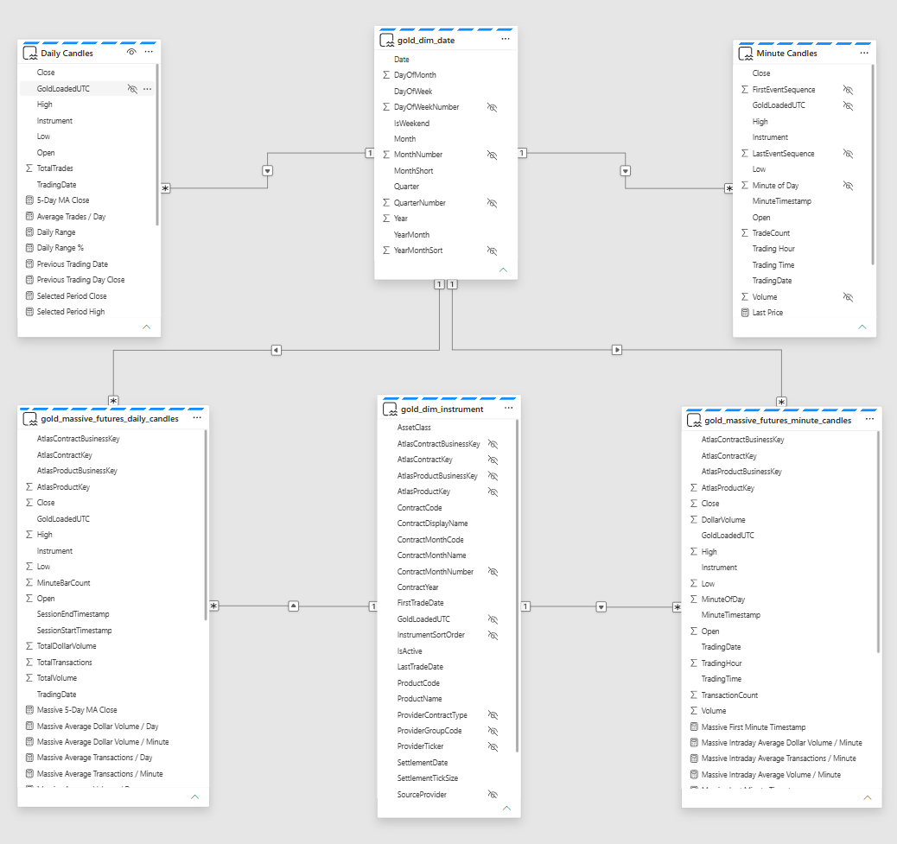

# Atlas Enterprise AI Intelligence Platform

**Microsoft Fabric · Data Engineering · Direct Lake · Power BI · Real-Time Intelligence · AI Engineering · Python**

> An enterprise-style Microsoft Fabric platform demonstrating historical and near-real-time market-data engineering, governed semantic modelling, interactive analytics and AI-ready data products.


**2 market-data providers · 17.3M validated CQG events · 2 governed Massive Futures contracts · 6-table Direct Lake model · Lakehouse + Eventhouse architectures**

---

## Overview

Atlas is a long-term Microsoft Fabric Data and AI portfolio platform built to demonstrate professional engineering across the full data lifecycle.

It combines three complementary market-data paths:

1. **CQG historical event data** processed through a Fabric Lakehouse medallion architecture.
2. **Massive historical minute aggregates** processed through governed Bronze, Silver and Gold layers.
3. **Massive delayed streaming aggregates** ingested through Fabric Eventstream and Eventhouse.

The platform demonstrates:

- large-volume data ingestion;
- source lineage and deterministic ordering;
- provider-specific and provider-neutral modelling;
- governed Bronze, Silver and Gold contracts;
- Direct Lake semantic modelling;
- reusable DAX measures;
- Power BI daily and intraday reporting;
- Fabric Real-Time Intelligence;
- Python integration;
- Azure Key Vault secret handling;
- deterministic AI analytical preparation;
- Architecture Decision Records;
- Fabric Git integration;
- pull-request-based releases.

Atlas is intentionally focused on **enterprise Data, Analytics and AI engineering**, not trading-strategy performance.

---

# Portfolio Highlights

## Interactive Power BI Market Analytics

Atlas exposes governed Gold data through the Direct Lake semantic model:

```text
sm_atlas_gold_reporting
```

The historical report provides:

- daily candlestick analysis;
- minute-level intraday analysis;
- Date and Instrument filtering;
- selected-period Open, High, Low and Close;
- return and range measures;
- previous-trading-day comparison;
- five-trading-day moving average;
- session activity measures;
- consistent navigation between report pages.


---

## Multi-Instrument Direct Lake Semantic Model

The semantic model now contains six governed analytical tables:

```text
Daily Candles
Minute Candles
gold_dim_date
gold_dim_instrument
gold_massive_futures_daily_candles
gold_massive_futures_minute_candles
```

The model implements:

- shared Date filtering;
- governed contract filtering;
- active one-to-many relationships;
- single-direction dimension filtering;
- separate CQG and Massive analytical facts;
- no fact-to-fact relationships;
- hidden technical keys;
- deterministic instrument display sorting;
- guarded single-contract price measures.



The first governed Massive contracts are:

```text
MESU6
Micro E-mini S&P 500 Sep 2026

MNQU6
Micro E-mini Nasdaq-100 Sep 2026
```

---

## Fabric Real-Time Intelligence

Atlas also demonstrates a near-real-time Microsoft Fabric architecture:

```text
Massive delayed Futures WebSocket
→ Atlas Python streaming adapter
→ Microsoft Fabric Eventstream
→ Eventhouse and KQL Database
→ KQL validation and monitoring
→ Fabric Real-Time Dashboard
```

The current implementation supports delayed one-minute Futures aggregates for:

```text
AM.MESU6
```

It preserves:

- provider timestamps;
- Atlas ingestion timestamps;
- deterministic event identifiers;
- raw provider payloads;
- OHLC values;
- volume and transaction values.


---

## Platform Architecture


Atlas currently contains three deliberately separated paths.

### CQG Historical Path

```text
CQG legacy Futures events
        |
        v
Python provider and Bronze processing
        |
        v
Microsoft Fabric Lakehouse
        |
        v
Bronze source-aligned data
        |
        v
silver_cqg_ticks
        |
        v
gold_cqg_minute_candles
        |
        v
gold_cqg_daily_candles
        |
        v
Direct Lake and Power BI
```

### Massive Historical Path

```text
Massive Futures Flat File
        |
        v
bronze_massive_futures_minute_aggregates
        |
        v
silver_massive_futures_minute_aggregates
        |
        v
gold_massive_futures_minute_candles
        |
        v
gold_massive_futures_daily_candles
        |
        v
gold_dim_date + gold_dim_instrument
        |
        v
Direct Lake and Power BI
```

### Massive Near-Real-Time Path

```text
Massive delayed Futures WebSocket
        |
        v
Atlas local Python adapter
        |
        v
Fabric Eventstream
        |
        v
Eventhouse and KQL Database
        |
        v
Real-Time Dashboard
```

The historical Lakehouse and near-real-time Eventhouse paths remain separate until governed reconciliation, correction handling and streaming Silver and Gold contracts are implemented.

---

# What Atlas Demonstrates

| Capability | Evidence in Atlas |
|---|---|
| **Microsoft Fabric Engineering** | Lakehouse, notebooks, Delta tables, Direct Lake, Eventstream, Eventhouse, KQL and Real-Time Dashboards |
| **Data Engineering** | Bronze, Silver and Gold processing across CQG and Massive provider paths |
| **Large-Volume Processing** | 17,317,408 validated CQG source events |
| **Dimensional Modelling** | Governed Date and Instrument dimensions with one-to-many relationships |
| **Semantic Modelling** | Six-table Direct Lake model, reusable DAX and guarded multi-instrument measures |
| **Power BI** | Daily and intraday candlestick reporting with governed KPI logic |
| **Real-Time Intelligence** | WebSocket ingestion through Eventstream and Eventhouse |
| **Python Engineering** | Provider abstraction, transformers, writers, diagnostics and streaming integration |
| **Security** | Azure Key Vault-backed Massive historical credentials |
| **AI Engineering** | Deterministic analytics separated from generative commentary |
| **Architecture Governance** | Explicit contracts, ADRs, grain, precision and scope boundaries |
| **Delivery Practice** | Fabric Git integration, GitHub branches, pull requests and semantic releases |

---

# v1.3.0 Multi-Instrument Architecture

The current development release expands Atlas beyond its original single historical CQG dataset.

## Implemented Scope

```text
Provider:
Massive

Dataset:
CME Futures minute aggregates

Contracts:
MESU6
MNQU6

Trading session:
2026-07-14
```

The controlled implementation adds:

```text
bronze_massive_futures_minute_aggregates
silver_massive_futures_minute_aggregates
gold_massive_futures_minute_candles
gold_massive_futures_daily_candles
gold_dim_instrument
```

Fabric notebooks include:

```text
nb_atlas_gold_dim_instrument
nb_atlas_bronze_massive_futures_minute_aggregates
nb_atlas_silver_massive_futures_minute_aggregates
nb_atlas_gold_massive_futures_candles
```

## Governed Identity

Atlas distinguishes:

- provider;
- provider ticker;
- trading venue;
- Futures product;
- dated Futures contract;
- Atlas product identity;
- Atlas contract identity.

Initial product keys:

```text
1001 → FUT-XCME-MES
1002 → FUT-XCME-MNQ
```

Initial contract keys:

```text
2001 → FUT-XCME-MES-2026-09
2002 → FUT-XCME-MNQ-2026-09
```

Provider symbols remain source attributes rather than permanent canonical relationship keys.

## Controlled Validation Results

```text
Massive Bronze rows:
2,760

Massive Silver rows:
2,760

Massive Gold minute rows:
2,760

Massive Gold daily rows:
2
```

Per-contract minute coverage:

```text
MESU6:
1,380 rows

MNQU6:
1,380 rows
```

Session coverage:

```text
2026-07-13 22:00:00 UTC
through
2026-07-14 20:59:00 UTC
```

Validation confirmed:

- physical source-row lineage;
- contract and product identity mapping;
- UTC minute boundaries;
- provider session-date preservation;
- OHLC consistency;
- non-negative activity values;
- unique Silver and Gold grain;
- deterministic daily Open and Close;
- daily Volume, Transactions and Dollar Volume reconciliation;
- active Date and Instrument relationships;
- correct Power BI filtering;
- multi-instrument-safe price measures.

---

# Selected Engineering Results

| Result | Value |
|---|---:|
| Validated CQG source events | 17,317,408 |
| CQG source size | ~722.7 MB |
| CQG Bronze Parquet chunks | 18 |
| CQG trading days | 26 |
| Massive source-object rows inspected | 89,951 |
| Massive provider tickers in source object | 937 |
| Governed Massive contracts | 2 |
| Massive historical minute rows | 2,760 |
| Massive historical daily rows | 2 |
| Direct Lake semantic-model tables | 6 |
| Market-data architecture paths | 3 |

---

# Medallion Architecture

Atlas uses explicit layer responsibilities.

## Bronze

Bronze preserves source fidelity and lineage.

CQG Bronze retains:

- source file identity;
- source row number;
- deterministic event sequence;
- provider event values.

Massive Bronze retains:

```text
source_provider
source_dataset
source_object_key
source_row_number
```

Massive Bronze preserves every accepted physical source row and does not apply arbitrary deduplication.

## Silver

CQG Silver represents:

> One row per CQG source market event.

Massive Silver represents:

> One provider-generated minute aggregate per provider ticker and UTC minute.

Silver responsibilities include:

- strong typing;
- canonical naming;
- identity enrichment;
- timestamp validation;
- OHLC validation;
- activity validation;
- duplicate detection;
- source lineage preservation.

## Gold

Current Gold assets include:

```text
gold_cqg_minute_candles
gold_cqg_daily_candles
gold_massive_futures_minute_candles
gold_massive_futures_daily_candles
gold_dim_date
gold_dim_instrument
```

CQG candles are generated from ordered source events.

Massive minute candles preserve trusted provider-generated aggregates.

Massive daily candles are derived from chronological minute bars.

Financial OHLC values currently use:

```text
Decimal(18,5)
```

for the validated initial contracts.


---

# Semantic Model and DAX

Massive measures are organised into governed display folders:

```text
Massive
├── Daily Activity
├── Daily Price
├── Daily Time Intelligence
├── Intraday Activity
├── Intraday Price
└── Intraday Time
```

Implemented measures include:

### Daily Price

```text
Massive Selected Period Open
Massive Selected Period High
Massive Selected Period Low
Massive Selected Period Close
Massive Selected Period Return %
Massive Selected Period Range
Massive Selected Period Range %
```

### Daily Time Intelligence

```text
Massive Selected Trading Date
Massive Previous Trading Date
Massive Selected Trading Day Close
Massive Previous Trading Day Close
Massive Trading Day Change
Massive Trading Day Change %
Massive 5-Day MA Close
```

### Intraday

```text
Massive Last Price
Massive Session Open
Massive Session High
Massive Session Low
Massive Session Close
Massive Session Change %
Massive Session Volume
Massive Session Transactions
Massive First Minute Timestamp
Massive Last Minute Timestamp
```

Price measures require one governed contract in filter context.

```text
One contract selected
→ return the market value

Zero or multiple contracts selected
→ return blank
```

This prevents misleading prices from unrelated Futures contracts being combined.

---

# Validated Multi-Instrument Results

## MESU6

```text
Open:      7,558.25
High:      7,613.75
Low:       7,531.75
Close:     7,590.50
Return:    0.43%
Range:     82.00
Volume:    958,226
```

## MNQU6

```text
Open:      29,440.00
High:      29,922.00
Low:       29,303.25
Close:     29,794.75
Return:    1.20%
Range:     618.75
Volume:    2,726,737
```

Validation was performed through:

```text
rpt_atlas_semantic_model_validation_dev
```

The report confirms consistent filtering across Massive daily and minute facts.

---

# Real-Time Intelligence

The current delayed streaming feed is:

```text
Endpoint:
wss://delayed.massive.com/futures

Subscription:
AM.MESU6
```

Implemented Fabric assets include:

```text
es_atlas_massive_futures_dev
eh_atlas_realtime_dev
raw_massive_futures_minute_aggregates
eh_atlas_realtime_dev_queryset
rtd_atlas_massive_futures_dev
```

The streaming adapter:

- authenticates with Massive;
- subscribes to one-minute aggregates;
- validates provider payloads;
- generates deterministic Atlas event identifiers;
- preserves raw payloads;
- publishes JSON events into Fabric Eventstream.

KQL validation includes:

- schema checks;
- duplicate-event analysis;
- OHLC checks;
- continuity analysis;
- provider-delay measurement;
- Fabric ingestion-latency measurement.

Observed development validation:

```text
Average provider delay:
approximately 603.91 seconds

Average Fabric ingestion latency:
approximately 0.47 seconds
```

The dominant latency came from the delayed provider feed rather than Fabric ingestion.

---

# AI Architecture

Atlas separates deterministic analytical calculations from generative inference.

```text
Trusted Gold analytics
        |
        v
Deterministic session summary
        |
        v
Structured AI prompt
        |
        v
Configurable inference provider
        |
        v
Human-readable commentary
```

Current AI notebooks:

```text
nb_gold_ai_session_summary
nb_gold_ai_market_commentary
```

The deterministic layer remains authoritative for:

- OHLC values;
- counts;
- returns;
- ranges;
- session direction;
- analytical classifications.

Generative AI is used only to explain or enrich trusted outputs.


Production-style hosted inference remains planned because the available development capacity did not support the attempted Fabric-hosted execution path.

---

# Technology Stack

| Area | Technology |
|---|---|
| Core Platform | Microsoft Fabric |
| Historical Storage | OneLake, Fabric Lakehouse, Delta tables |
| Historical Processing | Fabric notebooks, Apache Spark, PySpark |
| Semantic Model | Direct Lake |
| Reporting | Power BI and DAX |
| Streaming Ingestion | Fabric Eventstream |
| Streaming Storage | Eventhouse and KQL Database |
| Streaming Query | KQL |
| Programming | Python 3.12 |
| External Data | CQG legacy data, Massive Futures APIs and Flat Files |
| Credential Management | Azure Key Vault |
| AI Integration Direction | Azure AI Foundry, Azure OpenAI, Fabric AI |
| Source Control | Git, GitHub and Fabric Git integration |
| Development | Visual Studio Code |
| Governance | Data contracts and ADRs |
| Release Management | Pull requests, semantic versioning and GitHub releases |

---

# Repository Structure

```text
atlas/
├── fabric/          Microsoft Fabric item definitions
├── src/             Reusable Python source
├── scripts/         Diagnostics, discovery and validation
├── docs/            Architecture, contracts and ADRs
├── images/          Screenshots and diagrams
├── data/            Public-safe sample references
├── tests/           Test and validation assets
├── README.md
├── INSTALLATION.md
├── CHANGELOG.md
├── RELEASE_HISTORY.md
├── requirements.txt
├── LICENSE
└── .env.example
```

Fabric-managed assets are normally changed and validated in Microsoft Fabric first.

The development workflow is:

```text
Fabric changes
→ Fabric Git commit to dev
→ local git pull
→ local code and documentation updates
→ push to dev
→ pull request to main
→ merge
→ semantic version tag
→ GitHub release
```


Large proprietary market-data files, credentials, secret values, local environments and generated data are not committed.

---

# Documentation

Detailed engineering information is maintained outside this landing page.

| Document | Purpose |
|---|---|
| `docs/00_Project/ATLAS_MASTER_CONTEXT.md` | Authoritative high-level project context |
| `docs/01_Architecture/Atlas_Architecture.md` | Overall platform architecture |
| `docs/01_Architecture/Atlas_Near_Real_Time_Market_Data.md` | Eventstream and Eventhouse architecture |
| `docs/01_Architecture/Atlas_Multi_Instrument_Identity_and_Grain_Design.md` | Product, contract, identity and semantic-model design |
| `docs/01_Architecture/Massive_Futures_Bronze_Contract.md` | Massive physical-source Bronze contract |
| `docs/01_Architecture/Massive_Futures_Silver_Contract.md` | Massive validated Silver contract |
| `docs/01_Architecture/Massive_Futures_Gold_Contract.md` | Massive Gold and semantic-model contract |
| `INSTALLATION.md` | Local Python environment setup |
| `Development_Workflow.md` | Fabric, GitHub and VS Code workflow |
| `CHANGELOG.md` | Detailed change history |
| `RELEASE_HISTORY.md` | Release milestones |
| `docs/adr/` | Architecture Decision Records |

---

# Current Status

| Capability | Status |
|---|---|
| CQG historical Bronze, Silver and Gold | ✅ Complete |
| Massive historical Bronze, Silver and Gold | ✅ Controlled implementation complete |
| Gold Date dimension | ✅ Complete |
| Gold Instrument dimension | ✅ Complete |
| Six-table Direct Lake semantic model | ✅ Complete |
| Multi-instrument guarded measures | ✅ Complete |
| Power BI historical reporting | ✅ Complete |
| Semantic-model validation report | ✅ Complete |
| Deterministic AI preparation | ✅ Complete |
| AI provider abstraction | ✅ Complete |
| Hosted production-style AI inference | ⚠️ Planned |
| Local streaming adapter | ✅ Development foundation |
| Fabric Eventstream ingestion | ✅ Complete |
| Eventhouse and KQL storage | ✅ Complete |
| Real-Time Dashboard | ✅ Complete |
| Historical and streaming reconciliation | 🔜 Planned |
| Production orchestration | 🔜 Planned |
| Automatic Futures rollover | 🔜 Planned |

## Released

> **v1.2.0 — Reporting Navigation and Time Intelligence**

## In Release Consolidation

> **v1.3.0 — Multi-Instrument Architecture**

Remaining release work includes:

```text
documentation
Fabric Git commit
local repository synchronisation
regression validation
pull request
merge
v1.3.0 tag
GitHub release
```

## Next Planned Release

> **v1.4.0 — Production-Style AI Inference**

---

# Roadmap

## v1.3.0 — Multi-Instrument Architecture

**Implementation complete; release consolidation in progress**

- Massive historical Flat File ingestion;
- two governed Futures contracts;
- provider-neutral product and contract identity;
- `gold_dim_instrument`;
- Massive Bronze, Silver and Gold tables;
- Direct Lake model expansion;
- guarded daily and intraday measures;
- multi-instrument Power BI validation.

## v1.4.0 — Production-Style AI Inference

Planned focus:

- Azure AI Foundry or Azure OpenAI;
- secure provider configuration;
- prompt versioning;
- structured outputs;
- inference logging;
- provider and model traceability;
- evaluation and fallback behaviour;
- multi-instrument commentary.

## v1.5.0 — Real-Time Intelligence Expansion

Planned focus:

- managed streaming hosting;
- additional instruments;
- resilient reconnect and recovery;
- durable buffering and replay;
- duplicate and correction handling;
- streaming Silver and Gold;
- governed rollover;
- operational monitoring and alerts;
- historical and streaming reconciliation.

---

# Current Boundaries

Atlas is a validated portfolio and development platform, not a production trading system.

Current boundaries include:

- one controlled Massive historical trading session;
- two governed Massive contracts;
- delayed streaming data;
- locally hosted streaming adapter;
- no automatic contract rollover;
- no continuous-contract construction;
- no provider correction precedence;
- no unified historical and streaming facts;
- no formal exchange calendar;
- no production orchestration;
- hosted AI inference not yet operational;
- proprietary market data excluded from the repository.

These boundaries are documented explicitly rather than hidden behind unsupported claims.

---

# Portfolio Relevance

Atlas provides publicly reviewable evidence across:

- Microsoft Fabric engineering;
- Data Engineering;
- Data Architecture;
- Analytics Engineering;
- Power BI;
- Direct Lake semantic modelling;
- Real-Time Intelligence;
- Python integration;
- AI Engineering;
- technical governance;
- Git-based delivery.

The project demonstrates the complete lifecycle from source acquisition and physical lineage through semantic modelling, reporting, streaming, documentation and release management.

It is designed to support technical discussions for senior and contract roles such as:

- Microsoft Fabric Engineer;
- Data Engineer;
- Data and AI Engineer;
- Analytics Engineer;
- Data Architect;
- Power BI Engineer;
- Real-Time Intelligence Engineer.

---

# Disclaimer

Atlas Enterprise AI Intelligence Platform is provided for demonstration and educational purposes.

It is **not** a production trading system and does **not** provide financial or investment advice.

AI-generated commentary is illustrative only and must not be relied upon for trading or investment decisions.

---

**Released:** `v1.2.0 — Reporting Navigation and Time Intelligence`  
**In development:** `v1.3.0 — Multi-Instrument Architecture`