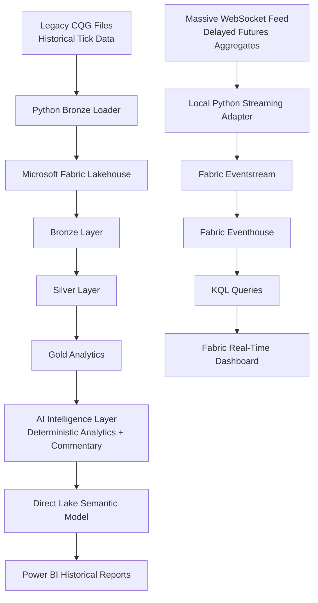
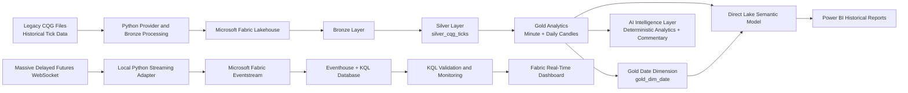

# Atlas Enterprise AI Intelligence Platform

Enterprise Microsoft Fabric • Data Engineering • Real-Time Intelligence • Artificial Intelligence • Power BI • Python

### End-to-End Microsoft Fabric Data, AI and Real-Time Intelligence Portfolio Project

> A professional portfolio project demonstrating historical and near-real-time market-data engineering, governed analytics, AI integration and Power BI reporting using Microsoft Fabric.


---

# Executive Summary

Atlas is an enterprise-style Microsoft Fabric Data and AI engineering portfolio project demonstrating the complete lifecycle of historical and near-real-time market data.

The platform currently supports two complementary architectural paths:

- **Historical analytics** using legacy CQG futures tick files processed through Bronze, Silver and Gold layers in a Microsoft Fabric Lakehouse.
- **Near-real-time monitoring** using a local Python streaming adapter, Massive delayed Futures WebSocket data, Microsoft Fabric Eventstream, Eventhouse, KQL and a live-refresh Real-Time Dashboard.

The historical reporting architecture includes:

- minute and daily OHLC candle datasets;
- a governed Gold date dimension;
- a Direct Lake semantic model;
- reusable selected-period and previous-trading-day measures;
- shared Date filtering across daily and intraday analysis;
- interactive Power BI candlestick reporting;
- explicit navigation between Market Overview and Intraday Analysis.

The near-real-time architecture includes:

- delayed futures minute aggregates;
- a governed Atlas streaming event envelope;
- deterministic event identifiers;
- preserved provider payloads and timestamps;
- Eventstream ingestion;
- Eventhouse storage;
- KQL validation and monitoring;
- a live-refresh Real-Time Dashboard.

Atlas is intentionally focused on **enterprise engineering capability** rather than trading-strategy implementation.

It demonstrates:

- Microsoft Fabric platform architecture;
- medallion data engineering;
- Direct Lake semantic modelling;
- Power BI reporting;
- Fabric Real-Time Intelligence;
- Python engineering;
- AI-ready deterministic analytics;
- provider abstraction;
- source control;
- architecture governance;
- professional documentation;
- semantic versioning;
- controlled release management.

The current release is:

> **v1.2.0 — Reporting Navigation and Time Intelligence**

The next planned release is:

> **v1.3.0 — Multi-Instrument Architecture**

---

# Platform Architecture


Atlas combines two complementary Microsoft Fabric architectures:

1. a historical Lakehouse and Direct Lake analytical path;
2. a near-real-time Eventstream and Eventhouse monitoring path.

These paths are intentionally separate at the current stage.

## Historical Analytical Path

```text
CQG legacy futures tick file
        |
        v
Python provider and Bronze processing
        |
        v
Microsoft Fabric Lakehouse
        |
        v
Bronze source-aligned data
        |
        v
silver_cqg_ticks
        |
        v
gold_cqg_minute_candles
        |
        v
gold_cqg_daily_candles
        |
        +----------------------+
        |                      |
        v                      v
gold_dim_date          Gold AI summaries
        |                      |
        v                      v
sm_atlas_gold_reporting
        |
        v
Power BI Market Overview
and Intraday Analysis
```

The historical path provides:

- source-aligned Bronze ingestion;
- deterministic event ordering;
- canonical Silver tick data;
- minute and daily OHLC candles;
- Decimal(18,5) financial precision;
- a governed continuous Date dimension;
- active one-to-many semantic-model relationships;
- reusable selected-period measures;
- reusable previous-trading-day measures;
- daily and intraday Power BI analysis;
- deterministic analytical inputs for AI commentary.

## Near-Real-Time Path

```text
Massive delayed Futures WebSocket
        |
        v
Local Atlas Python streaming adapter
        |
        v
Microsoft Fabric Eventstream
        |
        v
Eventhouse and KQL Database
        |
        v
raw_massive_futures_minute_aggregates
        |
        v
KQL validation and monitoring
        |
        v
Live-refresh Real-Time Dashboard
```

The near-real-time path provides:

- delayed futures minute aggregates;
- provider authentication and subscription handling;
- a governed Atlas streaming event envelope;
- deterministic Atlas event identifiers;
- preserved provider timestamps and raw payloads;
- Eventstream ingestion;
- Eventhouse storage;
- KQL schema, quality and latency validation;
- operational market monitoring through a Real-Time Dashboard.

## Current Architectural Boundary

The historical and near-real-time paths do not yet converge into a single canonical model.

Atlas does not yet provide:

- streaming Silver tables;
- streaming Gold candle tables;
- automatic historical and streaming reconciliation;
- destination-level deduplication;
- provider correction handling;
- automatic futures-contract rollover;
- production cloud hosting for the streaming adapter.

These are planned architectural increments rather than implied implemented capabilities.

---

# Near-Real-Time Market Data Foundation (v1.1.0)

Atlas `v1.1.0` introduced the first governed near-real-time market-data pathway in the platform.

The release demonstrates how Microsoft Fabric Real-Time Intelligence can complement the existing Lakehouse-based historical analytics architecture.

A local Python streaming adapter connects to the Massive delayed Futures WebSocket, authenticates, subscribes to minute aggregates, transforms provider events into the Atlas streaming event envelope and publishes them into Microsoft Fabric Eventstream.

Fabric routes the accepted JSON events into Eventhouse and a governed KQL table, where they can be validated, monitored and surfaced through a live-refresh Real-Time Dashboard.

## Implemented Components

- **Massive Futures streaming adapter**  
  `scripts/run_massive_futures_stream_adapter.py`

- **Massive Futures minute-aggregate transformer**  
  `src/common/transformers/massive_futures_minute_aggregate_transformer.py`

- **Fabric Eventstream writer**  
  `src/common/writers/FabricEventstreamWriter.py`

- **Microsoft Fabric Eventstream**  
  `es_atlas_massive_futures_dev`

- **Eventstream custom source**  
  `src_atlas_massive_futures`

- **Eventstream Eventhouse destination**  
  `dest_atlas_massive_futures_raw`

- **Microsoft Fabric Eventhouse and KQL Database**  
  `eh_atlas_realtime_dev`

- **Raw KQL table**  
  `raw_massive_futures_minute_aggregates`

- **JSON ingestion mapping**  
  `raw_massive_futures_minute_aggregates_json_mapping`

- **KQL queryset**  
  `eh_atlas_realtime_dev_queryset`

- **Real-Time Dashboard**  
  `rtd_atlas_massive_futures_dev`

## Current Provider Scope

```text
Endpoint:
wss://delayed.massive.com/futures

Subscription:
AM.MESU6
```

The current implementation receives delayed one-minute Futures aggregates for the September 2026 Micro E-mini S&P 500 contract.

## What v1.1.0 Demonstrates

- provider WebSocket authentication and subscription;
- continuously arriving delayed market events;
- provider-specific payload transformation;
- a governed Atlas streaming event envelope;
- deterministic Atlas event identifiers;
- preserved provider timestamps;
- preserved raw provider payloads;
- Python-to-Eventstream publishing;
- Eventstream-to-Eventhouse routing;
- explicit KQL table schema;
- JSON ingestion mapping;
- KQL schema and data-quality validation;
- duplicate-event checks;
- continuity analysis;
- provider-delay analysis;
- Fabric ingestion-latency analysis;
- live-refresh operational dashboarding;
- clear separation between historical analytics and near-real-time monitoring.

## Current Hosting Position

The streaming adapter is intentionally development-hosted and currently runs locally.

It is not yet a production service and does not currently provide:

- managed cloud hosting;
- durable buffering;
- replay;
- automatic process recovery;
- production secret management;
- managed identity;
- automatic futures-contract rollover;
- destination-level deduplication;
- provider correction handling.

These limitations are documented explicitly and form part of the later Real-Time Intelligence roadmap.

---

## Historical + Near-Real-Time Data Flow



---

# Key Capabilities

- Enterprise Medallion Architecture across Bronze, Silver and Gold layers
- Microsoft Fabric Lakehouse for historical market-data processing
- Large-volume CQG legacy tick-data ingestion
- Source lineage and deterministic event ordering
- Canonical Silver tick modelling
- Minute and daily OHLC candle generation
- Decimal(18,5) financial precision
- Governed Gold date dimension
- Shared Date filtering across daily and intraday analysis
- Direct Lake semantic modelling
- Active one-to-many Date relationships
- Reusable selected-period measures
- Reusable previous-trading-day measures
- Multi-instrument-safe distinct Trading Days calculation
- Validated five-trading-day moving average
- Interactive Power BI Market Overview report
- Interactive Power BI Intraday Analysis report
- Custom candlestick visualisation
- Explicit page navigation between report pages
- Deterministic session analytics
- AI-ready analytical summaries
- Provider-agnostic AI abstraction layer
- AI-generated market-commentary framework
- Massive delayed Futures WebSocket integration
- Local Python near-real-time streaming adapter
- Governed Atlas streaming event envelope
- Deterministic streaming event identifiers
- Microsoft Fabric Eventstream ingestion
- Eventhouse and KQL Database storage
- Explicit JSON ingestion mapping
- KQL validation, continuity and latency analysis
- Live-refresh Fabric Real-Time Dashboard
- GitHub-integrated Microsoft Fabric development workflow
- Pull-request-based release management
- Architecture Decision Records
- Semantic versioning
- Professional architecture, contract, installation and release documentation

---

## End-to-End Data Flow



---

# Technology Stack

| Area | Technology |
|------|------------|
| Core Data Platform | Microsoft Fabric |
| Historical Storage | OneLake, Fabric Lakehouse, Delta tables |
| Near-Real-Time Storage | Eventhouse and KQL Database |
| Historical Processing | Fabric notebooks, Apache Spark, PySpark |
| Near-Real-Time Ingestion | Microsoft Fabric Eventstream |
| Query Languages | SQL, KQL, DAX |
| Programming | Python 3.12 |
| Data Formats | CQG text files, Parquet, Delta, JSON |
| Semantic Modelling | Direct Lake semantic model |
| Historical Reporting | Power BI |
| Candlestick Visualisation | Custom Power BI candlestick visual |
| Operational Monitoring | Fabric Real-Time Dashboard |
| AI Architecture | Deterministic analytics, prompt generation, provider abstraction |
| AI Integration Patterns | Fabric AI, Azure AI Foundry, Azure OpenAI |
| Streaming Integration | Massive delayed Futures WebSocket |
| Event Publishing | Event Hubs-compatible Fabric Eventstream custom endpoint |
| Source Control | Git and GitHub |
| Fabric Source Control | Fabric Git integration |
| Development Environment | Visual Studio Code |
| Environment Configuration | Python virtual environments, `requirements.txt`, `.env` |
| Architecture Governance | Data contracts and Architecture Decision Records |
| Release Management | Pull requests, semantic versioning and GitHub releases |

---

# AI Architecture

Atlas deliberately separates deterministic analytics from non-deterministic generative AI.

Core market facts are calculated through governed data-engineering and semantic-model logic before they are supplied to an AI provider.

## Deterministic Analytical Layer

The deterministic layer is responsible for:

- Bronze ingestion;
- Silver transformation;
- Gold analytical processing;
- minute and daily OHLC generation;
- session statistics;
- selected-period measures;
- previous-trading-day measures;
- range and return calculations;
- volatility and directional classifications;
- prompt preparation;
- validation of trusted analytical inputs.

These calculations remain authoritative regardless of whether an AI provider is available.

## Generative AI Layer

The generative layer is responsible for:

- provider selection;
- model invocation;
- natural-language commentary;
- prompt and provider metadata;
- inference status;
- error handling;
- fallback behaviour;
- provider independence.

The model is not treated as the authoritative calculator of prices, returns, counts or other core market facts.

## Current AI Components

```text
nb_gold_ai_session_summary
nb_gold_ai_market_commentary
```

`nb_gold_ai_session_summary` prepares deterministic market context from governed Gold data.

`nb_gold_ai_market_commentary` converts that structured context into human-readable commentary through an extensible provider abstraction.

## Provider Abstraction

The AI architecture is designed to support multiple inference options, including:

- Microsoft Fabric AI capabilities;
- Azure AI Foundry;
- Azure OpenAI;
- approved external providers;
- mock or offline providers for development and validation.

This allows provider implementations to change without rewriting the analytical pipeline.

## Current Execution Position

The AI integration framework is implemented and validated.

Production-style hosted inference is not yet fully operational because the available Fabric capacity and permissions did not support the attempted live inference path.

The platform records:

- provider;
- model;
- prompt or request metadata;
- inference status;
- generated timestamp;
- failure details.

Inference failure does not interrupt deterministic analytical processing.

## Future AI Direction

Future releases may add:

- approved hosted model deployments;
- secure secret management;
- prompt versioning;
- structured model outputs;
- model and provider traceability;
- cost monitoring;
- inference evaluation;
- fallback providers;
- multi-instrument commentary;
- operational monitoring of AI execution.

AI will continue to enrich trusted Atlas analytics rather than replace deterministic calculation logic.

---

# Repository Structure

```text
Atlas/

├── fabric/              Microsoft Fabric-managed item definitions
├── src/                 Reusable Python source code
├── scripts/             Development, diagnostic and validation utilities
├── docs/                Architecture, contracts, ADRs and project documentation
├── images/              Screenshots and architecture diagrams
├── data/                Sample or local data references
├── tests/               Automated and manual test assets

├── README.md
├── INSTALLATION.md
├── requirements.txt
├── CHANGELOG.md
├── RELEASE_HISTORY.md
├── Development_Workflow.md
├── LICENSE
└── .env.example
```

Key project documentation includes:

```text
docs/00_Project/ATLAS_MASTER_CONTEXT.md
docs/01_Architecture/Atlas_Architecture.md
docs/01_Architecture/Atlas_Near_Real_Time_Market_Data.md
docs/01_Architecture/Fabric_Bronze_Ingestion.md
docs/01_Architecture/Silver_Contract.md
docs/01_Architecture/Gold_Contract.md
docs/adr/
```

Fabric-managed assets include:

- notebooks;
- semantic models;
- reports;
- item metadata and definition files generated through Fabric Git integration.

Reusable local source includes:

- market-data providers;
- canonical models;
- Bronze storage components;
- streaming transformers;
- Eventstream writers.

Development and validation scripts include:

- provider smoke tests;
- CQG ingestion utilities;
- Parquet validation;
- Massive REST and WebSocket diagnostics;
- streaming-transformer tests;
- Eventstream publishing diagnostics;
- the local near-real-time streaming adapter.

Fabric-managed changes are normally made and validated in Microsoft Fabric first, then committed to the GitHub `dev` branch through Fabric Git integration.

Local Python source, scripts and documentation are updated in Visual Studio Code after pulling the latest `dev` changes.

Large proprietary market-data files, credentials, local virtual environments and generated runtime artefacts are not committed to the public repository.

---

# Project Screenshots

## Interactive Historical Trading Report

Atlas exposes governed Gold analytics through the `sm_atlas_gold_reporting` Direct Lake semantic model and an interactive Power BI report.

The report contains two analytical pages:

### Market Overview

- daily candlestick analysis;
- adjustable date-range filtering;
- instrument filtering;
- Selected Period Open;
- Selected Period High;
- Selected Period Low;
- Selected Period Close;
- Daily Range;
- Daily Range percentage;
- Selected Period Return percentage;
- Trading Days;
- Trading Day Change percentage;
- Total Trades;
- validated five-trading-day moving average;
- explicit navigation to Intraday Analysis.

### Intraday Analysis

- minute-level candlestick analysis;
- single-date selection;
- instrument filtering;
- Last Price;
- Session High;
- Session Low;
- Session Trade Count;
- explicit navigation back to Market Overview.

Both pages use the governed `gold_dim_date` table for Date filtering.

Daily-to-intraday drill-through was evaluated but deferred because the current free candlestick custom visual does not expose compatible Power BI drill-through context.


---

## Medallion Data Flow and Gold Assets

Atlas implements a governed Medallion Architecture in Microsoft Fabric.

Historical market data is:

1. preserved in source-aligned Bronze structures;
2. standardised into the canonical Silver model;
3. transformed into minute and daily Gold candles;
4. enriched with a governed Gold date dimension;
5. exposed through a Direct Lake semantic model;
6. consumed by Power BI and deterministic AI analytics.


---

## AI Market Commentary Notebook

The AI Intelligence layer demonstrates:

- deterministic analytical preparation;
- structured prompt generation;
- provider abstraction;
- inference metadata capture;
- controlled failure handling;
- separation between trusted market facts and generated commentary.

Inference failures are recorded without interrupting the deterministic analytical pipeline.


---

## Near-Real-Time Fabric Dashboard

Atlas v1.1.0 introduced a live-refresh Fabric Real-Time Dashboard over Eventhouse and KQL data.

The dashboard provides a near-real-time operational view of delayed `MESU6` minute aggregates, including:

- recent event records;
- delayed close-price monitoring;
- delayed volume monitoring;
- continuously refreshed Eventhouse results.

The dashboard demonstrates delayed continuously arriving market data rather than exchange-live pricing.


---

## GitHub Development Workflow

Atlas follows a professional Git-based development workflow integrated with Microsoft Fabric.

The workflow includes:

- Fabric Git integration with the `dev` branch;
- Fabric-first changes for Fabric-managed assets;
- local Python and documentation development in Visual Studio Code;
- pull requests from `dev` to `main`;
- reviewed merges;
- semantic version tags;
- GitHub releases;
- branch synchronisation after release completion.


---

# Near-Real-Time Validation Results

Atlas v1.1.0 was validated end to end using delayed Futures minute aggregates published from the local Python streaming adapter into Microsoft Fabric Eventstream and ingested into Eventhouse.

## Validation Checks Completed

- WebSocket connection established successfully
- Provider authentication completed successfully
- Subscription to `AM.MESU6` confirmed
- Atlas streaming event envelopes generated successfully
- Events published successfully to the Fabric Eventstream custom endpoint
- Events routed successfully into Eventhouse
- JSON ingestion mapping applied successfully
- Expected KQL schema confirmed
- Latest events visible in the raw KQL table
- No duplicate `atlas_event_id` values detected in the validated sample
- Minute continuity confirmed across the captured sample
- OHLC integrity checks passed
- Non-negative volume and transaction checks passed
- Provider timestamps preserved
- Atlas ingestion timestamps populated
- Raw provider payloads retained
- KQL validation and monitoring queries executed successfully
- Dashboard-source queries returned recent events
- Live refresh confirmed in the Fabric Real-Time Dashboard

## Observed Latency Profile

The validated sample demonstrated the expected behaviour for delayed provider data:

```text
Average provider delay: approximately 603.91 seconds
Average Fabric ingestion latency: approximately 0.47 seconds
Average end-to-end latency: approximately 604.38 seconds
```

The results indicate that the dominant latency was introduced by the delayed upstream market-data feed rather than by Fabric ingestion.

These values are observations from the development environment and are not production service-level commitments.

## Validation Scope

The completed validation confirms the first Atlas near-real-time vertical slice:

```text
Massive delayed Futures WebSocket
→ local Python streaming adapter
→ Fabric Eventstream
→ Eventhouse and KQL Database
→ KQL validation and monitoring
→ Fabric Real-Time Dashboard
```

It does not yet validate:

- production cloud hosting;
- durable buffering or replay;
- multiple simultaneous instruments;
- destination-level duplicate suppression;
- provider correction handling;
- automatic futures-contract rollover;
- streaming Silver and Gold models;
- historical and streaming reconciliation.

---

# Documentation

Atlas treats documentation as part of the implementation rather than as a final presentation task.

Key documents include:

| Document | Description |
|----------|-------------|
| `README.md` | Public project overview and portfolio landing page |
| `INSTALLATION.md` | Local environment, Python and dependency setup |
| `CHANGELOG.md` | Detailed technical change history |
| `RELEASE_HISTORY.md` | Release milestones and project evolution |
| `Development_Workflow.md` | Fabric, GitHub and Visual Studio Code development workflow |
| `docs/00_Project/ATLAS_MASTER_CONTEXT.md` | Authoritative high-level project context |
| `docs/01_Architecture/Atlas_Architecture.md` | Core platform architecture |
| `docs/01_Architecture/Atlas_Near_Real_Time_Market_Data.md` | Near-real-time Eventstream and Eventhouse architecture |
| `docs/01_Architecture/Fabric_Bronze_Ingestion.md` | Bronze ingestion design |
| `docs/01_Architecture/Silver_Contract.md` | Canonical Silver data contract |
| `docs/01_Architecture/Gold_Contract.md` | Gold candles, date dimension, semantic model and reporting contract |
| `docs/adr/` | Architecture Decision Records |

The current ADR set includes decisions covering:

- Microsoft Fabric as the core platform;
- Medallion Architecture;
- AI-assisted development;
- Direct Lake;
- certified semantic-model direction;
- Bronze provider strategy;
- multi-AI workflow;
- Bronze ingestion;
- the near-real-time Eventstream architecture.

The latest architectural ADR is:

```text
ADR-009-Why-Near-Real-Time-Eventstream-Architecture.md
```

Documentation is reviewed alongside implementation changes so that:

- current assets are described accurately;
- planned capabilities are not presented as implemented;
- limitations remain explicit;
- table, notebook and Fabric item names stay aligned;
- release documentation reflects the validated repository state.

---

# Current Project Status

| Component | Status |
|-----------|--------|
| Bronze Layer | ✅ Complete |
| Silver Layer | ✅ Complete |
| Gold Minute and Daily Candles | ✅ Complete |
| Gold Date Dimension | ✅ Complete |
| Direct Lake Semantic Model | ✅ Complete |
| Historical Power BI Reporting | ✅ Complete |
| Shared Date Filtering | ✅ Complete |
| Reusable Selected-Period Measures | ✅ Complete |
| Previous-Trading-Day Measures | ✅ Complete |
| Report Page Navigation | ✅ Complete |
| AI Analytical Preparation | ✅ Complete |
| AI Provider Abstraction | ✅ Complete |
| Hosted AI Inference | ⚠️ Environment-limited |
| Near-Real-Time Streaming Adapter | ✅ Development foundation complete |
| Fabric Eventstream Ingestion | ✅ Complete |
| Eventhouse and KQL Storage | ✅ Complete |
| KQL Validation and Monitoring | ✅ Complete |
| Fabric Real-Time Dashboard | ✅ Complete |
| Architecture and Contract Documentation | ✅ Complete |
| Fabric and GitHub Development Workflow | ✅ Complete |
| `v1.1.0` Near-Real-Time Foundation | ✅ Complete |
| `v1.2.0` Reporting Navigation and Time Intelligence | ✅ Complete |
| `v1.3.0` Multi-Instrument Architecture | 🔜 Next planned release |

## Current Release

> **v1.2.0 — Reporting Navigation and Time Intelligence**

The current release strengthened the historical reporting architecture through:

- `nb_gold_dim_date`;
- the governed `gold_dim_date` Delta table;
- active one-to-many Date relationships;
- shared Date filtering across daily and minute analytical tables;
- reusable selected-period measures;
- reusable previous-trading-day measures;
- a multi-instrument-safe Trading Days calculation;
- improved date formatting and sort behaviour;
- consistent KPI-card styling;
- explicit navigation between Market Overview and Intraday Analysis.

## Next Planned Release

> **v1.3.0 — Multi-Instrument Architecture**

The next release will focus on:

- provider-neutral instrument identity;
- stable instrument keys;
- additional historical instruments or contracts;
- a governed instrument dimension;
- Silver and Gold grain validation;
- multi-instrument semantic-model relationships;
- date and instrument filter interaction;
- measure behaviour under multi-instrument selections;
- preparation for future historical and streaming convergence.

---

# Known Limitations

Atlas is a validated portfolio platform and development foundation rather than a production trading system.

## Historical Data Scope

The historical Lakehouse architecture is still validated principally against one large CQG futures dataset:

```text
F.US.EU6M12
```

The model has not yet been fully validated across multiple instruments, providers, exchanges or asset classes.

Multi-instrument behaviour is the focus of `v1.3.0`.

## Development-Hosted Streaming

The near-real-time Python streaming adapter currently runs locally.

The current implementation does not yet provide:

- production cloud hosting;
- managed service supervision;
- durable buffering;
- replay;
- automatic process restart;
- managed identity;
- production secret management;
- operational service-level monitoring.

The current streaming implementation should therefore be treated as a validated development foundation rather than a production deployment.

## Delayed Market Data

The Massive Futures feed used by Atlas is delayed.

Observed provider delay during validation was approximately ten minutes.

The Real-Time Dashboard demonstrates continuously arriving delayed market data rather than exchange-live pricing.

## Limited Streaming Scope

The current near-real-time implementation supports:

```text
AM.MESU6
```

The current scope does not yet include:

- multiple simultaneous instruments;
- multiple event types;
- automatic futures-contract rollover;
- continuous-contract construction;
- broader provider coverage.

## Historical and Near-Real-Time Separation

The Lakehouse and Eventhouse paths remain intentionally separate.

Atlas does not yet provide:

- streaming Silver tables;
- streaming Gold candle tables;
- promotion from Eventhouse into canonical Lakehouse tables;
- automatic reconciliation between historical and streamed events;
- unified historical and near-real-time semantic models.

## Duplicate and Correction Handling

Deterministic Atlas event identifiers support duplicate analysis.

However:

- destination-level duplicate suppression is not enforced;
- provider correction messages are not yet handled;
- replay is not implemented;
- revised or late intervals are not reconciled automatically.

## Trading Calendar Logic

`gold_dim_date` provides one row per calendar date and deterministic weekend classification.

Atlas does not yet implement:

- exchange-specific holidays;
- early-close sessions;
- daylight-saving session rules;
- asset-specific trading calendars;
- formal `IsTradingDay` logic.

Selecting a weekend or another date with no market data may therefore produce blank report visuals, which is expected.

## Drill-Through Limitation

Daily-to-intraday drill-through was evaluated during `v1.2.0`.

The semantic model and target-page setup worked with standard Power BI visuals.

The current free candlestick custom visual does not expose selected-candle context compatible with Power BI drill-through.

Atlas therefore uses explicit page-navigation controls instead.

## Custom Visual Dependency

The historical report depends on a free custom Power BI candlestick visual.

The visual supports the required daily and minute candlestick presentation, but some native Power BI interactions may not be available.

## Hosted AI Inference

The AI analytical framework and provider abstraction are implemented.

Production-style hosted inference remains constrained by:

- available Fabric capacity;
- model deployment availability;
- permissions;
- secure secret handling;
- provider configuration;
- cost controls;
- inference monitoring.

Inference failure does not interrupt deterministic analytical processing.

## Environment and Deployment

Atlas does not yet have a complete multi-environment deployment strategy covering:

- development;
- test;
- staging;
- production;
- deployment pipelines;
- parameterised configuration;
- promotion approvals;
- rollback procedures.

## Orchestration and Automated Testing

Current processing still depends on controlled manual execution and validation.

Future improvements should include:

- production orchestration;
- scheduling;
- retries;
- failure notifications;
- run metadata;
- broader unit-test coverage;
- notebook regression testing;
- semantic-model regression testing;
- streaming integration tests;
- CI enforcement before merge.

## Data Licensing

Large proprietary or restricted market-data files are not included in the public repository.

The repository uses documentation, schemas, screenshots, representative samples and reproducible instructions instead.

Provider licensing and redistribution rights must be reviewed before adding new historical or streaming datasets.

---

# Roadmap

Atlas evolves through controlled, feature-oriented releases.

The roadmap preserves a deliberate separation between:

- historical Lakehouse engineering;
- governed Direct Lake reporting;
- near-real-time Eventstream and Eventhouse ingestion;
- multi-instrument modelling;
- production-style AI inference;
- expanded Real-Time Intelligence.

## v1.3.0 — Multi-Instrument Architecture

**Status:** Next planned release

Planned focus:

- ingest selected additional historical instruments or contracts;
- validate Massive historical data access and provider constraints;
- define provider-neutral instrument identity;
- introduce stable Atlas instrument keys;
- distinguish provider symbol, exchange, asset class, product and contract identity;
- introduce or strengthen a governed instrument dimension;
- review Silver and Gold grain and keys;
- validate date and instrument filtering together;
- validate measure behaviour across multiple instruments;
- prevent misleading cross-instrument totals;
- review semantic-model relationships;
- progress the certified semantic-model approach;
- assess contract-month and futures-rollover representation;
- prepare for future historical and near-real-time convergence.

Automatic futures-contract rollover and continuous-contract construction will remain outside the first increment unless required by the validated design.

## v1.4.0 — Production-Style AI Inference

**Status:** Planned

Planned focus:

- Azure AI Foundry or Azure OpenAI integration;
- approved hosted model deployment;
- secure configuration and secret handling;
- configurable AI providers;
- prompt templates and versioning;
- structured model inputs and outputs;
- provider and model traceability;
- inference logging;
- validation and fallback behaviour;
- cost and capacity controls;
- multi-instrument market commentary.

Deterministic Atlas analytics will remain authoritative.

Generative AI will continue to explain and enrich trusted calculated outputs rather than replace them.

## v1.5.0 — Real-Time Intelligence Expansion

**Status:** Planned

Planned focus:

- production-style hosting for the streaming adapter;
- multiple simultaneous instruments;
- additional event types;
- resilient WebSocket reconnection and recovery;
- durable buffering and replay;
- duplicate and correction handling;
- schema-evolution controls;
- automatic or governed contract rollover;
- streaming transformations;
- streaming Silver and Gold models;
- near-real-time OHLC aggregation;
- reusable KQL functions and monitoring patterns;
- expanded Real-Time Dashboards;
- Fabric Activator and configurable alerts where appropriate;
- operational observability;
- historical and streaming reconciliation;
- environment and deployment controls;
- performance and cost testing.

## v1.6.0 and Beyond

Potential later capabilities include:

- technical indicators;
- volatility analytics;
- comparative instrument analysis;
- anomaly detection;
- configurable market and data-quality alerts;
- AI-assisted market investigation;
- historical market replay;
- strategy-research foundations;
- backtesting support;
- data-quality dashboards;
- Fabric pipeline orchestration;
- deployment automation;
- CI/CD expansion;
- environment promotion;
- semantic-model certification;
- security hardening;
- capacity and cost monitoring;
- operational support documentation.

The exact sequence of later releases will depend on:

- architectural dependencies;
- Fabric capacity;
- provider licensing;
- historical and streaming data availability;
- portfolio value;
- relevance to current contract opportunities.

---

# Portfolio Relevance

Atlas has been developed as a professional Microsoft Fabric portfolio project for senior and contract opportunities across:

- Data Engineering;
- Microsoft Fabric Engineering;
- Data Architecture;
- Analytics Engineering;
- Power BI;
- Real-Time Intelligence;
- AI Engineering;
- cloud data-platform delivery.

The project demonstrates practical capability across the full engineering lifecycle rather than presenting isolated notebooks or report screenshots.

## Data Engineering

Atlas demonstrates:

- large-volume market-data ingestion;
- Bronze, Silver and Gold layer design;
- source lineage;
- deterministic event ordering;
- canonical data modelling;
- OHLC aggregation;
- financial precision management;
- validation and reconciliation;
- provider abstraction;
- reusable Python components.

## Microsoft Fabric

Atlas demonstrates hands-on use of:

- OneLake;
- Fabric Lakehouse;
- Delta tables;
- Fabric notebooks;
- Apache Spark and PySpark;
- Direct Lake semantic models;
- Power BI;
- Fabric Git integration;
- Eventstream;
- Eventhouse;
- KQL Database;
- KQL querysets;
- Fabric Real-Time Dashboards.

## Semantic Modelling and Reporting

Atlas demonstrates:

- explicit analytical grain;
- governed Gold dimensions;
- one-to-many semantic-model relationships;
- reusable DAX measures;
- time-intelligence patterns;
- daily and intraday reporting;
- custom candlestick visualisation;
- filter propagation;
- report-page navigation;
- multi-instrument-aware measure design.

## Real-Time Intelligence

Atlas demonstrates:

- WebSocket market-data ingestion;
- local Python streaming integration;
- governed JSON event contracts;
- deterministic event identifiers;
- Eventstream publishing;
- Eventhouse ingestion;
- KQL validation;
- continuity and latency analysis;
- live-refresh operational dashboards;
- clear distinction between delayed and exchange-live data.

## AI Engineering

Atlas demonstrates:

- deterministic analytical preparation;
- AI-ready structured inputs;
- provider abstraction;
- prompt generation;
- model and provider metadata;
- controlled failure handling;
- separation of trusted calculations from generated commentary;
- a clear path toward Azure AI Foundry and Azure OpenAI integration.

## Software and Delivery Engineering

Atlas demonstrates:

- Git and GitHub;
- branch-based development;
- pull requests;
- semantic versioning;
- GitHub releases;
- Fabric-first source-control workflows;
- modular Python design;
- validation scripts;
- environment configuration;
- professional repository structure.

## Architecture and Governance

Atlas demonstrates:

- explicit data contracts;
- Architecture Decision Records;
- documented grain and precision;
- separation of architectural responsibilities;
- honest representation of limitations;
- release planning;
- incremental delivery;
- maintainable documentation;
- alignment between implementation and public-facing claims.

The project is intended to provide a credible, publicly reviewable example of enterprise Data, AI and Microsoft Fabric engineering.

It is not presented as a production trading platform or as evidence of trading-strategy performance.

---

# Disclaimer

Atlas Enterprise AI Intelligence Platform is provided for demonstration and educational purposes.

It is **not** a production trading system and does **not** provide financial or investment advice.

Any AI-generated market commentary is illustrative only and should not be relied upon when making trading or investment decisions.

---

## Current Release

**v1.2.0 — Reporting Navigation and Time Intelligence**