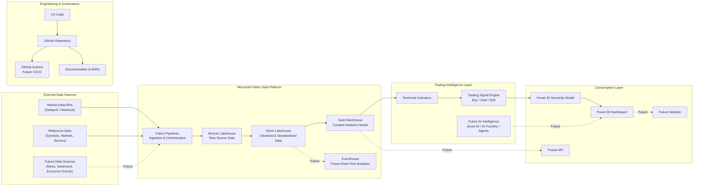
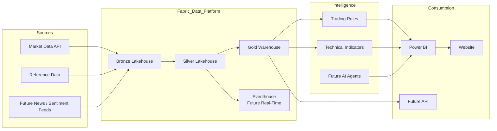

# Solution Architecture

## Atlas - AI Trading Intelligence Platform

## Purpose

This document describes the high-level solution architecture for Atlas.

Atlas is an enterprise AI intelligence platform initially focused on trading and financial market decision support. The solution is designed to demonstrate modern Microsoft Data & AI engineering practices while providing a reusable foundation for future UKFI products.

---

## Architecture Objectives

Atlas must:

- Ingest market data from external data providers.
- Store raw, cleansed and curated data using medallion architecture.
- Support SQL, notebook, PySpark and KQL-based processing.
- Provide a trusted analytics layer for Power BI.
- Generate transparent trading indicators and decision-support signals.
- Support future AI capabilities such as market commentary, agentic analysis and natural language interaction.
- Use GitHub and VS Code as the primary engineering workflow.
- Remain modular enough to support future products beyond trading.

---

## High-Level Architecture



---

## Core Components

| Component | Purpose |
|---|---|
| Market Data APIs | Provide delayed, historical or low-cost financial market data. |
| Fabric Pipelines | Orchestrate ingestion from external sources into the data platform. |
| Bronze Lakehouse | Store raw source data with minimal transformation. |
| Silver Lakehouse | Store cleansed, standardised and validated datasets. |
| Gold Warehouse | Provide curated analytics-ready data structures. |
| Trading Signal Engine | Generate transparent trading indicators and Buy / Hold / Sell style signals. |
| Semantic Model | Provide governed Power BI reporting layer. |
| Power BI Dashboard | Present KPIs, trends, signals and portfolio-style insights. |
| Future AI Intelligence Layer | Add LLM summaries, natural language analysis, agents and explainability. |
| GitHub Repository | Source control for documentation, code, scripts and deployment assets. |
| VS Code | Primary development environment. |

---

## Data Flow

### 1. Ingestion

External market data is ingested from selected APIs or file-based sources using Microsoft Fabric pipelines.

Initial MVP data sources are expected to be delayed or historical feeds to control cost and avoid unnecessary real-time complexity.

### 2. Bronze Layer

The Bronze layer stores raw market data as received from source systems.

This layer supports traceability, replay and future reprocessing.

### 3. Silver Layer

The Silver layer contains cleansed and standardised market data.

Typical processing may include:

- Date and time standardisation
- Ticker symbol standardisation
- Removal of duplicates
- Handling of missing values
- Type conversion
- Basic data quality checks

### 4. Gold Layer

The Gold layer provides curated analytics structures optimised for reporting and trading intelligence.

This layer may include:

- Instrument dimension
- Date dimension
- Price fact table
- Indicator fact table
- Signal fact table
- Portfolio or watchlist entities

### 5. Analytics and Reporting

Power BI consumes the curated model through a semantic layer.

The dashboard will initially focus on:

- Price movements
- Trading signals
- Trend indicators
- Signal history
- Performance measures
- Portfolio or watchlist-level KPIs

### 6. Intelligence Layer

The first MVP will prioritise transparent rule-based signals.

Future releases may add:

- AI-generated market commentary
- News and sentiment analysis
- Natural language Q&A
- Agentic investigation of price movements
- Explainable recommendation summaries
- Alerting and notification workflows

---

## Logical Architecture



---

## MVP Architecture Boundary

The MVP will focus on the following end-to-end slice:

```text
Market Data API
    ↓
Fabric Pipeline
    ↓
Bronze Lakehouse
    ↓
Silver Transformation
    ↓
Gold Warehouse
    ↓
Trading Signal Logic
    ↓
Power BI Dashboard
```

The following are intentionally deferred:

- Automated live trading
- Broker integration
- Paid real-time feeds
- Multi-user SaaS platform
- Subscription management
- Production website integration
- Advanced agentic workflows

---

## Engineering Architecture

Atlas will use a GitHub-first engineering workflow.

```text
VS Code
   ↓
Git
   ↓
GitHub Repository
   ↓
Feature Branches
   ↓
Pull Requests
   ↓
Main Branch
   ↓
Versioned Releases
```

During the initiation and architecture stages, direct commits to `main` are acceptable because no production code exists.

Once implementation begins, new work should move to feature branches.

---

## Repository Mapping

| Repository Area | Purpose |
|---|---|
| `docs/00_Project` | Project management documents including PID, roadmap and release plan. |
| `docs/01_Architecture` | Architecture documentation. |
| `docs/adr` | Architecture Decision Records. |
| `src/fabric/pipelines` | Fabric pipeline definitions and related assets. |
| `src/fabric/notebooks` | Fabric notebooks for transformation and analysis. |
| `src/fabric/sql` | SQL scripts, warehouse objects and transformations. |
| `src/fabric/kql` | KQL scripts for Eventhouse / Real-Time Intelligence. |
| `src/functions` | Azure Functions or serverless components. |
| `src/api` | Future API layer. |
| `src/powerbi` | Power BI-related artefacts and documentation. |
| `src/website` | Future public-facing website or product UI. |
| `infrastructure` | Infrastructure-as-code or environment setup assets. |
| `tests` | Test scripts and validation assets. |
| `data/sample` | Safe sample data for public demonstration. |

---

## Security and Governance Principles

The MVP will follow pragmatic but enterprise-aligned security principles.

- No secrets committed to GitHub.
- API keys stored securely outside source control.
- Public repository will avoid proprietary trading logic.
- Sensitive or commercial algorithms may move to private repositories.
- Data sources must be licensed appropriately.
- Personal or customer data will not be used in the MVP.
- Public documentation should be suitable for clients and recruiters.
- Architecture decisions should be recorded using ADRs.

---

## Cost Management Principles

The MVP will prioritise cost control.

- Use delayed or historical market data where possible.
- Avoid paid real-time feeds until commercially justified.
- Use development-scale Fabric workloads.
- Keep datasets small during early development.
- Introduce additional Azure services only when they provide clear value.
- Monitor Fabric capacity and Azure costs as the architecture matures.

---

## Future Architecture Evolution

Atlas is expected to evolve beyond the MVP.

Potential future capabilities include:

- Real-time market streaming
- Eventhouse-based real-time analytics
- Advanced backtesting
- AI-generated trade explanations
- Sentiment analysis
- Economic calendar integration
- Portfolio simulation
- Website dashboard
- API layer
- Authentication
- Multi-product UKFI platform components
- Databricks integration where justified by workload or client need

---

## Architecture Summary

Atlas will use Microsoft Fabric as the core data and analytics platform, supported by GitHub, VS Code, Power BI and future Azure AI services.

The initial architecture is intentionally simple, modular and explainable. It prioritises delivering a working end-to-end MVP while preserving a path toward commercial product development, advanced intelligence features and reusable UKFI platform components.